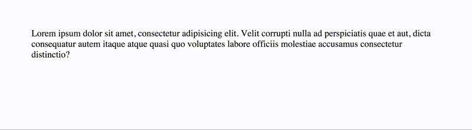

# Fluid

### `fluid(property, min, max, options?)`

| `Argument` | Type | Default | Description |
| :--- | :--- | :--- | :--- |
| `property` | `string` | - | CSS property to apply responsive size to |
| `min` | `string` | - | Minimum property size |
| `max` | `string` | - | Maximum property size |
| `options.minScreenSize` | `string` | `'480px'` | Minimum screen size bounds for responsive units |
| `options.maxScreenSize` | `string` | `'1280px'` | Maximum screen size bounds for responsive units |

Sets a fluid value for a property based on property name and min and max values. It has sane defaults for upper and lower viewport constraints, but you can also adjust these by setting `minScreenSize` and `maxScreenSize` in `options`.



Values can be in any standard CSS unit.

```javascript
import { fluid } from 'satchel-css';

// Default viewport constraints
`${fluid('font-size', '2rem', '3.5rem')}`;

// Custom viewport constraints
`${fluid('font-size', '3.5rem', '4.5rem', {
  minScreenSize: '60em',
  maxScreenSize: '90em',
})}`;
```

## How it works

Fluid units work by using `calc()` in combination with `vw` units to scale between two values based on the width of the viewport, as well as media queries to set the range in which the unit is fluid.



```javascript
fluid('font-size', '15px', '19px', {
  minScreenSize: '400px',
  maxScreenSize: '1280px',
});
```



```css
font-size: calc(15px + 4 * ((100vw - 400px) / 880));

@media (max-width: 400px) {
  font-size: 15px;
}

@media (min-width: 1280px) {
  font-size: 19px;
}
```

With the calc expression being equivalent to

```text
min-size + (min-size - max-size) * ( (100vw - min-width) / ( max-width - min-width) )
```



